```mermaid
graph TD
    subgraph "Proyecto OAF: Investigación Estratégica"
        A[Director Humano Define Objetivo] --> B[Orquestador: Activar Prompt de Sistema];
        
        B --> C[1 - Diseñar Misión];
        
        subgraph "Ciclo de Iteración UIC"
            C -- "Seleccionar Arquetipo ej 1" --> D[Prompt Específico para DR];
            D --> E[2 - Agente DR Ejecuta Misión];
            E -- "Informe con Fuentes y Metadatos" --> F[3 - Actualizar DB de Metadatos];
            E -- "Informe de Síntesis" --> G[4 - Orquestador: Evaluar y Diagnosticar];
            F -- "Contexto de Activos de Datos" --> G;
            G -- "Diagnóstico: Brechas, Calidad, ROI" --> H[5 - Director Humano: Decisión Estratégica];
            H -- "Avanzar" --> I[Fin del Ciclo o Nueva Fase];
            H -- "Refinar" --> C;
            H -- "Pivotar por Anti-Patrón" --> C;
        end
    end

    %% Estilos de los nodos
    style A fill:#000,stroke:#fff,stroke-width:2px,color:#fff
    style B fill:#8E44AD,stroke:#fff,stroke-width:2px,color:#fff
    style G fill:#8E44AD,stroke:#fff,stroke-width:2px,color:#fff
    style E fill:#2980B9,stroke:#fff,stroke-width:2px,color:#fff
    style F fill:#16A085,stroke:#fff,stroke-width:2px,color:#fff
    style H fill:#D35400,stroke:#fff,stroke-width:2px,color:#fff
    style I fill:#27AE60,stroke:#fff,stroke-width:2px,color:#fff
```

# The Orchestrator-Agent Framework (OAF)

### Una Metodología Sistemática para la Investigación Colaborativa Humano-IA en la Era Agéntica

---

## Abstract

*(El Abstract que redactemos irá aquí. Por ahora, un placeholder)*

Este paper introduce el **Orchestrator-Agent Framework (OAF)**, una metodología sistemática que estructura la colaboración entre un investigador humano y sistemas de IA especializados para maximizar la eficiencia, profundidad y reproducibilidad de la investigación en ciencia de datos. El OAF se basa en una arquitectura dual y funcionalmente distinta, inspirada en la teoría del proceso dual de la cognición... *(resumen completo)*

## El Problema: El Caos Agéntico y los Anti-Patrones de Investigación

El uso no estructurado de las potentes herramientas de IA actuales a menudo conduce a flujos de trabajo ineficientes y resultados subóptimos. El OAF está diseñado explícitamente para combatir estos **anti-patrones**:

-   **Cacería Heroica de Datos:** Semanas o meses dedicados a la búsqueda manual de fuentes, con un bajo retorno de la inversión de tiempo.
-   **Parálisis por Análisis:** Un ciclo interminable de exploración de datos sin un camino claro hacia el insight accionable.
-   **Hipótesis Huérfana:** Inversión de recursos significativos en líneas de investigación que resultan ser callejones sin salida.
-   **Sobresaturación Técnica:** Comunicación de resultados centrada en la complejidad técnica en lugar del valor de negocio y el ROI.

## La Solución OAF: Una Arquitectura de Inteligencia Híbrida

El OAF propone una división deliberada del trabajo cognitivo entre dos componentes de IA distintos, gobernados por un director humano.

1.  **El Agente de Deep Research (DR) - El "Explorador" (Sistema 1):**
    -   **Tecnología:** Un motor de investigación autónomo (ej. Google AI's Deep Research, Perplexity Pro) optimizado para la búsqueda masiva.
    -   **Función:** Escanea cientos de fuentes web, papers académicos y APIs para **recolectar y sintetizar conocimiento externo**. Es el "Sistema 1": rápido, exploratorio y generador de hipótesis. Su trabajo es entregar informes estructurados y poblar nuestra base de datos de metadatos.

2.  **El Orquestador - El "Estratega" (Sistema 2):**
    -   **Tecnología:** Un Large Language Model conversacional con una vasta ventana de contexto (ej. Gemini 1.5/2.5 Pro) operando bajo un **Prompt de Sistema robusto**.
    -   **Función:** No realiza búsquedas. Su rol es **razonar sobre el contexto proporcionado**. Ingiere los informes del Agente DR, analiza el estado del proyecto, diagnostica brechas y ayuda al director humano a diseñar la siguiente misión estratégica. Es el "Sistema 2": lento, deliberativo y crítico.

### Diagrama de Flujo Detallado del OAF

Este diagrama ilustra cómo el OAF transforma la investigación en un ciclo iterativo y estratégico, donde cada fase es una oportunidad para aplicar un **Arquetipo de Misión** específico.

## Anti-Patrones Abordados por el OAF

El OAF está diseñado explícitamente para mitigar los "anti-patrones" comunes en la investigación no estructurada:

- **La Cacería Heroica de Datos:** Reemplazada por misiones DR eficientes y dirigidas.
- **La Parálisis por Análisis:** Evitada por el ciclo de pivotamiento del OAF cuando se detectan rendimientos decrecientes.
- **La Hipótesis Huérfana:** Minimizada al validar la viabilidad de las líneas de investigación de forma temprana.
- **La Sobresaturación Técnica en la Comunicación:** Mitigada al enfocar el rol del Orquestador en traducir los hallazgos técnicos a valor de negocio (ROI).

## Cómo Usar este Repositorio

1.  **Lea el Paper Completo:** Para una comprensión profunda de los fundamentos teóricos y la metodología, consulte el documento en la carpeta `/Paper`.
2.  **Examine los Prompts:** La carpeta `/Prompts` contiene el **Prompt Maestro del Orquestador V8**. Este es el artefacto central y puede ser adaptado para sus propios proyectos.
3.  **Contribuya:** Este es un proyecto en evolución. Las contribuciones, sugerencias y casos de estudio de aplicación del OAF son bienvenidos.

## Cita

Si encuentra útil este trabajo, por favor considere citar nuestro paper:

[Tu Nombre], [Nombre de tu Profesor], et al. (Año). *The Orchestrator-Agent Framework (OAF): A Systematic Methodology for Human-AI Collaborative Research in Data Science*. [Nombre de la Revista o Repositorio, ej. arXiv].

