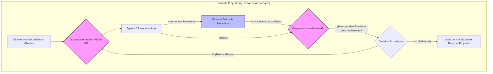

# Human-AI-Collaborative-Research-Framework
### A Systematic Methodology for Human-AI Collaborative Research in Data Science

---

## Abstract

El advenimiento de los Large Language Models (LLMs) ha creado nuevas oportunidades para acelerar la investigación en ciencia de datos, pero su aplicación a menudo sigue siendo ad-hoc e inestructurada. Esto limita la reproducibilidad y la eficiencia. Este paper introduce el **Orchestrator-Agent Framework (OAF)**, una metodología sistemática que estructura la colaboración entre un investigador humano y sistemas de IA. El framework se basa en una arquitectura dual: (1) un **Orquestador de Razonamiento**, un LLM con una vasta ventana de contexto que actúa como estratega y sintetizador central; y (2) **Agentes de Deep Research (DR)**, LLMs agenticos especializados en la recolección y síntesis de conocimiento externo. Describimos el núcleo del framework: el **Ciclo de Iteración Universal (UIC)**, un proceso gobernado por el Orquestador para diseñar, ejecutar, evaluar y refinar misiones de investigación en todas las fases de un proyecto de ciencia de datos. Se presentan seis arquetipos de misiones estratégicas y se discuten las implicaciones del OAF para la eficiencia, la innovación y la transparencia en la investigación.

## Contenido del Repositorio

- **/Paper**: Contiene el manuscrito completo del paper de investigación en formato PDF y/o LaTeX.
- **/Presentation**: Material de presentación que resume los hallazgos clave.
- **/Prompts**: Contiene los prompts de sistema y de misión, incluyendo el Prompt Maestro del Orquestador V8, como artefactos replicables.

## El Framework OAF de un Vistazo

El OAF es un sistema diseñado para transformar la investigación con IA de un proceso caótico a una ciencia sistemática. Se basa en una colaboración estructurada entre dos roles clave:

1.  **El Orquestador (Director Humano):** El estratega "Sistema 2" que aplica juicio experto, define la misión y valida los resultados.
2.  **El Agente de Deep Research (DR):** El motor de exploración "Sistema 1" que realiza búsquedas masivas de información, sintetiza fuentes y genera hipótesis.

La interacción entre ambos es gobernada por el **Ciclo de Iteración Universal (UIC)**.

### Diagrama de Flujo del OAF



## Anti-Patrones Abordados por el OAF

El OAF está diseñado explícitamente para mitigar los "anti-patrones" comunes en la investigación no estructurada:

- **La Cacería Heroica de Datos:** Reemplazada por misiones DR eficientes y dirigidas.
- **La Parálisis por Análisis:** Evitada por el ciclo de pivotamiento del OAF cuando se detectan rendimientos decrecientes.
- **La Hipótesis Huérfana:** Minimizada al validar la viabilidad de las líneas de investigación de forma temprana.
- **La Sobresaturación Técnica en la Comunicación:** Mitigada al enfocar el rol del Orquestador en traducir los hallazgos técnicos a valor de negocio (ROI).

## Cómo Usar este Repositorio

1.  **Lea el Paper Completo:** Para una comprensión profunda de los fundamentos teóricos y la metodología, consulte el documento en la carpeta `/Paper`.
2.  **Examine los Prompts:** La carpeta `/Prompts` contiene el **Prompt Maestro del Orquestador V8**. Este es el artefacto central y puede ser adaptado para sus propios proyectos.
3.  **Contribuya:** Este es un proyecto en evolución. Las contribuciones, sugerencias y casos de estudio de aplicación del OAF son bienvenidos.

## Cita

Si encuentra útil este trabajo, por favor considere citar nuestro paper:

[Tu Nombre], [Nombre de tu Profesor], et al. (Año). *The Orchestrator-Agent Framework (OAF): A Systematic Methodology for Human-AI Collaborative Research in Data Science*. [Nombre de la Revista o Repositorio, ej. arXiv].

---
```

### **Plan de Acción Inmediato:**

1.  **Crea el Repositorio:** Ve a GitHub, crea un nuevo repositorio. Te recomiendo el nombre **`The-Orchestrator-Agent-Framework`**.
2.  **Crea el `README.md`:** Copia y pega el texto de arriba en un nuevo archivo `README.md` en el repositorio. GitHub renderizará el diagrama de Mermaid automáticamente, lo cual se verá muy profesional.
3.  **Sube los Archivos:** Crea las carpetas (`/Paper`, `/Prompts`) y sube el borrador de nuestro paper y el archivo con el Prompt V8.

Una vez hecho esto, tendrás una base sólida y profesional para tu proyecto.

**Ahora sí, ¿quieres que redactemos el Abstract para completar el `README.md` y el paper?**
