¡Excelente pregunta! Tienes toda la razón. Un `README.md` no es solo un resumen, es la **"página de aterrizaje" (landing page) de tu proyecto**. Su objetivo principal es convencer al visitante de que **invierta su tiempo** en lo que has creado. Debe ser persuasivo.

Actualmente, tu `README` es un excelente resumen técnico. Ahora lo transformaremos en una **herramienta de marketing para tu investigación**, manteniendo toda la sustancia pero añadiendo una capa de narrativa convincente.

Mi recomendación es estructurarlo en una narrativa de "dolor y ganancia" (Pain & Gain).

1.  **El Dolor:** Presentar el problema del "caos agéntico" de una forma que cualquier investigador o científico de datos sienta en carne propia.
2.  **La Promesa (Ganancia):** Posicionar al OAF no como "una metodología", sino como "la solución" a ese dolor.
3.  **La Prueba:** Mostrar evidencia de que funciona (el diagrama, el caso de estudio).
4.  **La Llamada a la Acción:** Invitar explícitamente a leer el paper y usar la metodología.

Aquí tienes la versión mejorada del `README.md`, reescrita con un tono más persuasivo.

---

### **README.md Mejorado (Versión Persuasiva)**

```markdown


# The Orchestrator-Agent Framework (OAF)

**¿Eres un científico de datos o investigador usando IA? ¿Sientes que pasas más tiempo luchando con tus herramientas que generando insights? ¿Estás atrapado en un ciclo de búsqueda interminable de datos, análisis sin fin y resultados que no logran impactar?**

**No estás solo. Bienvenido al Caos Agéntico.**

La era de la IA agéntica promete una velocidad sin precedentes, pero a menudo nos entrega frustración. El uso no estructurado de herramientas como Deep Research y LLMs avanzados nos arrastra hacia **anti-patrones de investigación**: ciclos de trabajo que queman nuestro tiempo, nuestra energía cognitiva y nuestro presupuesto.

Este repositorio presenta una solución: **The Orchestrator-Agent Framework (OAF)**, una metodología sistemática para transformar tu flujo de trabajo de un arte caótico a una ciencia eficiente y de alto impacto.

---

## ¿Cuál es el Problema Real? Los 4 Anti-Patrones que te están Frenando

El OAF está diseñado para combatir las ineficiencias que todo investigador moderno enfrenta:

-   **La Cacería Heroica de Datos:** Semanas o meses perdidos en la búsqueda manual de fuentes, de las cuales el 90% resultan ser irrelevantes.
-   **La Parálisis por Análisis:** Un mar de gráficos y modelos que no logran contar una historia clara o llevar a una decisión de negocio.
-   **La Hipótesis Huérfana:** Inversión de recursos valiosos en líneas de investigación que terminan siendo callejones sin salida.
-   **La Brecha de Comunicación:** Hallazgos técnicos brillantes que no logran traducirse en un impacto tangible para los stakeholders.

## La Solución OAF: Una Arquitectura de Inteligencia Híbrida

El OAF no es solo una "mejor práctica", es una nueva forma de operar. Proponemos una división deliberada del trabajo entre dos componentes distintos, gobernados por ti, el director.

1.  **El Agente de Deep Research (DR) - Tu "Explorador" Incansable:**
    -   **Tecnología:** Un motor de investigación autónomo (ej. Google AI's Deep Research) optimizado para la búsqueda masiva.
    -   **Misión:** Externalizar la "cacería de datos". Escanea cientos de fuentes, extrae datasets, y sintetiza literatura, entregándote el conocimiento del mundo de forma estructurada.

2.  **El Orquestador - Tu "Estratega" de IA:**
    -   **Tecnología:** Un LLM de gran contexto (ej. Gemini 2.5 Pro) operando bajo nuestro **Prompt Maestro V10**.
    -   **Misión:** Actuar como tu co-piloto estratégico. Analiza los informes del DR, diagnostica brechas, te protege de los anti-patrones y te ayuda a decidir el siguiente movimiento de mayor ROI.

### El Proceso en Acción: El Ciclo OAF

Este diagrama ilustra cómo el OAF transforma la investigación en un ciclo estratégico, no lineal. **Para una explicación detallada de cada paso, consulta la Sección 3 de nuestro paper.**

```mermaid
graph TD
    subgraph "Proyecto OAF: Investigación Estratégica"
        A[Director Humano Define Objetivo] --> B[Orquestador: Activar Prompt de Sistema];
        
        B --> C[1 - Diseñar Misión];
        
        subgraph "Ciclo de Iteración UIC"
            C -- "Seleccionar Arquetipo ej 1" --> D[Prompt Específico para DR];
            D --> E[2 - Agente DR Ejecuta Misión];
            E -- "Informe con Fuentes y Metadatos" --> F[3 - Actualizar DB de Metadatos];
            E -- "Informe de Síntesis" --> G[4 - Orquestador: Evaluar y Diagnosticar];
            F -- "Contexto de Activos de Datos" --> G;
            G -- "Diagnóstico: Brechas, Calidad, ROI" --> H[5 - Director Humano: Decisión Estratégica];
            H -- "Avanzar" --> I[Fin del Ciclo o Nueva Fase];
            H -- "Refinar" --> C;
            H -- "Pivotar por Anti-Patrón" --> C;
        end
    end

    %% Estilos de los nodos
    style A fill:#000,stroke:#fff,stroke-width:2px,color:#fff
    style B fill:#8E44AD,stroke:#fff,stroke-width:2px,color:#fff
    style G fill:#8E44AD,stroke:#fff,stroke-width:2px,color:#fff
    style E fill:#2980B9,stroke:#fff,stroke-width:2px,color:#fff
    style F fill:#16A085,stroke:#fff,stroke-width:2px,color:#fff
    style H fill:#D35400,stroke:#fff,stroke-width:2px,color:#fff
    style I fill:#27AE60,stroke:#fff,stroke-width:2px,color:#fff
```



## ¿Por qué leer el paper?

Este `README` te da el "qué". El paper te da el "porqué" y el "cómo". En él encontrarás:

-   La **fundamentación teórica** del OAF en la ciencia cognitiva (Kahneman) y la tecnología de IA (Transformers, ReAct).
-   Un **caso de estudio post-mortem** detallado que demuestra cómo el OAF habría reducido un proyecto de 6 meses a menos de uno.
-   Una **validación externa** con la investigación de MIT/Harvard que logró comprimir 12 años de trabajo en 2 días usando un enfoque análogo.
-   Una **discusión profunda** sobre las implicaciones del OAF para la crisis de reproducibilidad y el futuro de la ciencia de datos.

## Comienza a Usar el OAF Ahora

1.  **Lee el Paper Completo:** Para una comprensión profunda, empieza con el documento en la carpeta [`/Paper`](./Paper/).
2.  **Obtén el "Código Fuente":** La carpeta [`/Prompts`](./Prompts/) contiene el **Prompt Maestro del Orquestador V10**. Este es el artefacto central y replicable de nuestra metodología.
3.  **Explora el Caso de Estudio:** La carpeta [`/Case_Study_Metro_CDMX`](./Case_Study_Metro_CDMX/) contiene los materiales del proyecto que inspiró este framework.
4.  **Contribuye:** Este es un proyecto en evolución. Las sugerencias, los nuevos arquetipos y los casos de estudio son bienvenidos.

## Cita

Si este trabajo te resulta útil para tu propia investigación, te agradeceríamos que citaras nuestro paper:

> [Tu Nombre], et al. (Año). *The Orchestrator-Agent Framework (OAF): A Systematic Methodology for Human-AI Collaborative Research in Data Science*. [Nombre de la Revista o Repositorio, ej. arXiv].


